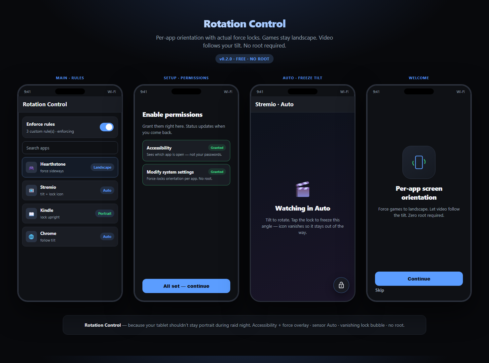
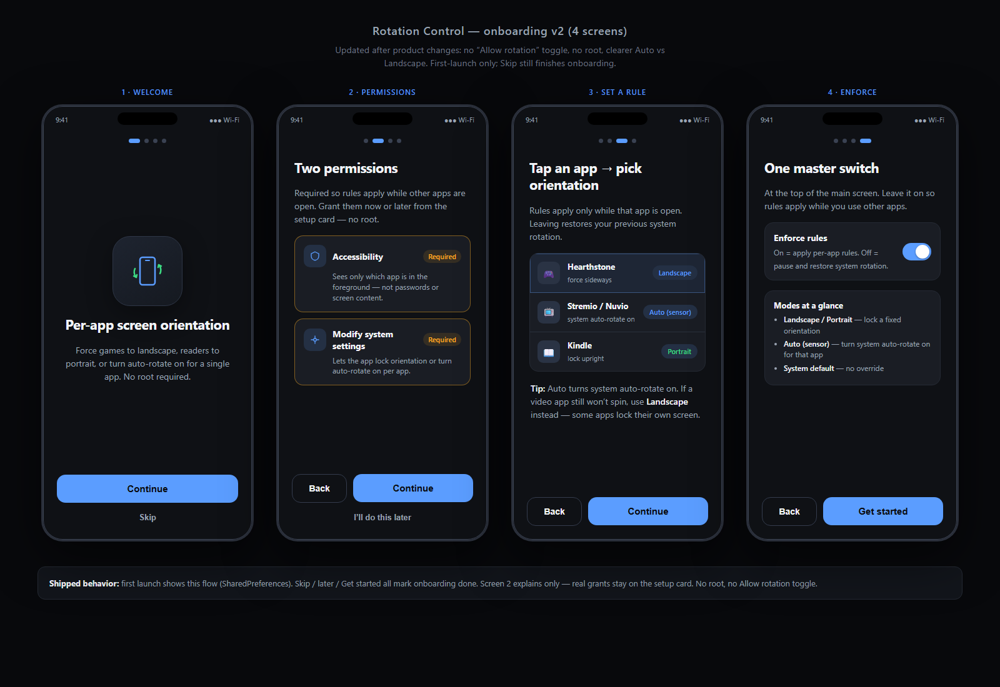

# Rotation Control

Per-app screen orientation for Android.

Set a game to landscape, a reader to portrait, or leave a video app on Auto so it follows the device tilt. When you leave that app, the system orientation is restored — so landscape does not stick on the home screen.

No root required.

<p align="center">
  
</p>

## Features

| | |
|--|--|
| **Per-app rules** | System default, Portrait, Landscape, Reverse portrait/landscape, Auto (sensor) |
| **Auto** | Follows tilt using the same force-lock path as fixed Landscape (works on devices that ignore free sensor mode) |
| **Lock control** | While Auto is active, a temporary lock icon freezes the current angle, then hides |
| **Onboarding** | Grant Accessibility and Modify system settings during setup |
| **Restore on exit** | Leaving a ruled app restores the previous system rotation |

## Screenshots

| Main screen | Onboarding |
|-------------|------------|
|  |  |

## Install

Download the latest release APK from [Releases](https://github.com/Charles-3Ready/rotation-control/releases).

Prefer **`RotationControl-*-release.apk`**.

```bash
adb install -r RotationControl-0.2.0-release.apk
```

1. Install the APK (allow installs from unknown sources if needed).
2. Open Rotation Control and complete onboarding.
3. Enable **Accessibility** for Rotation Control.
4. Allow **Modify system settings**.
5. Pick an app and set an orientation rule.

## Permissions

| Permission | Why |
|------------|-----|
| **Accessibility** (required) | Detects the foreground app package only. Does not read passwords or full screen content. |
| **Modify system settings** (recommended) | Applies orientation locks via system settings. |

## How it works

1. An accessibility service sees which package is in the foreground.
2. A local rules store maps package → orientation mode.
3. An accessibility overlay requests the chosen orientation (and Auto follows the accelerometer).
4. Leaving the app clears the override and restores the previous system state.

## Build

```powershell
cd rotation-control
.\gradlew.bat assembleRelease
```

APK: `app\build\outputs\apk\release\app-release.apk`

Requires JDK 17 and Android SDK 35.

## Limitations

- Some apps hard-code their own orientation; fixed Landscape/Portrait usually still works.
- Aggressive OEM battery savers can delay the accessibility service — whitelist the app if rules feel slow.
- Not published on the Play Store yet; distribute via GitHub Releases.

## Support

Rotation Control is free and has no ads. If it helps and you want to tip:

[](https://ko-fi.com/luminarystudios)

Or open [ko-fi.com/luminarystudios](https://ko-fi.com/luminarystudios). Totally optional.

## License

Free for personal use. Do not resell as a closed product under another name.

---

**Charles-3Ready** · [Releases](https://github.com/Charles-3Ready/rotation-control/releases) · [Ko-fi](https://ko-fi.com/luminarystudios)
